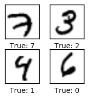

# xiaonet
A Xiao (Tiny) Neural Network to illustrate the basics of forward and backpropegation, activation using, and softmax, logistic regression with cross entropy and cost minimization with gradient descent.

```python
from xiaonet import *
```
```python
# load the complete MNIST dataset
from xiaoloader import load_mnist
dataset = load_mnist()

import numpy as np
%matplotlib inline
import matplotlib.pyplot as plt

images = dataset.train.images[0:4]
labels = np.array([label.argmax() for label in dataset.train.labels[0:4]])
plot_images(images, labels)
```

