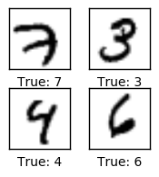

# xiaonet
A Xiao (Tiny) Neural Network to illustrate the basics of forward and backpropegation, activation using sigmoid, and softmax, cost optimization using mean squared error and cross entropy.

```python
# load the complete MNIST dataset
from xiaoloader import load_mnist
dataset = load_mnist()

import numpy as np
%matplotlib inline
import matplotlib.pyplot as plt

images = dataset.train.images[0:4]
labels = np.array([label.argmax() for label in dataset.test.labels[0:4]])
plot_images(images, labels)
```




